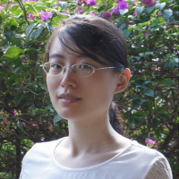

{: .image-left } I was graduated from NTU and am currently working as a marketing specialist in Singapore.

This blog serves to record the questions and answers I've found during my study, work and life.

{: .resize }  yliu9055@gmail.com