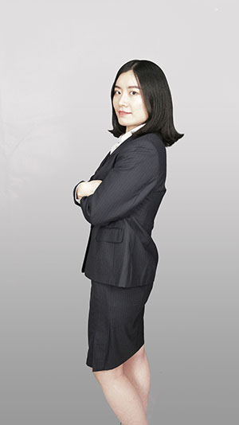

{: .image-left } My name is Liu Yang. I graduated from NTU with a B.S. in chemistry. I have been working as a marketing assistant in a publishing house. 

This blog serves to record the questions and answers I've found during my study, work and life, centered on science, IT and expat life in Singapore.

{: .resize }  yliu9055@gmail.com

{: .resize }  +65-81788856.